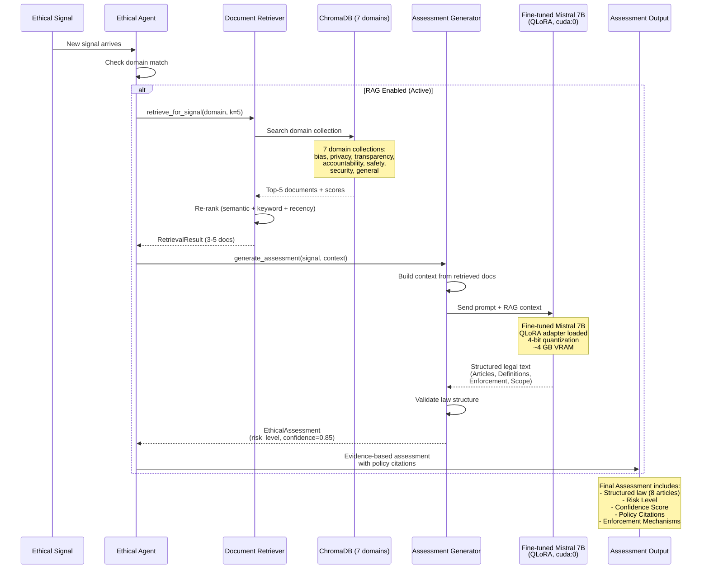
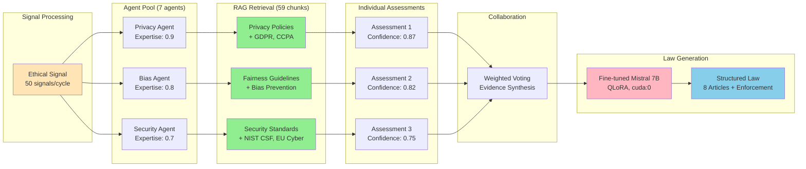
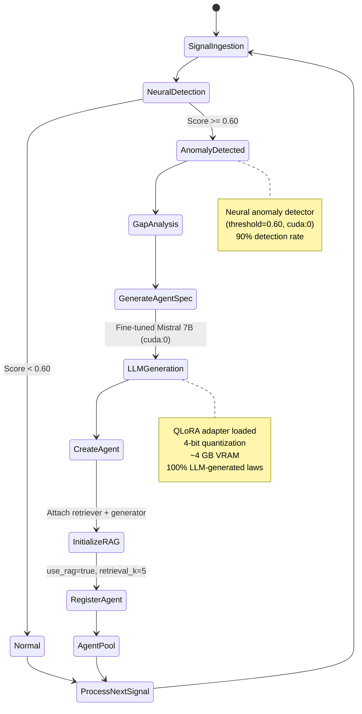
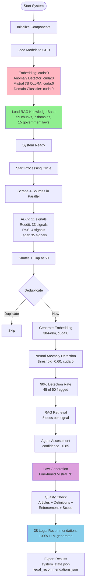
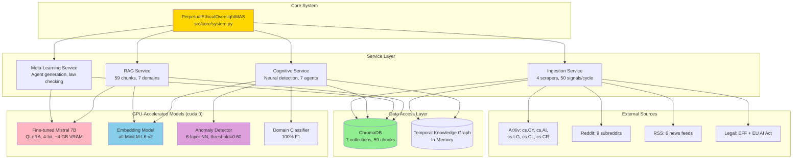
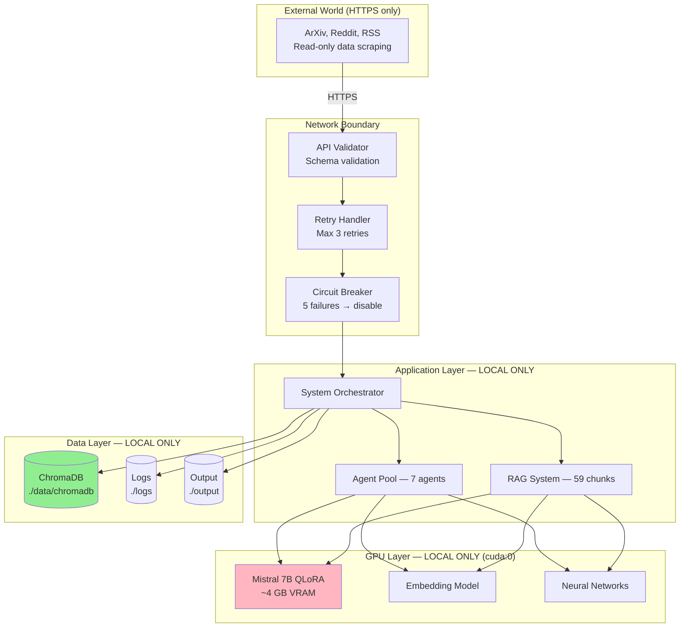
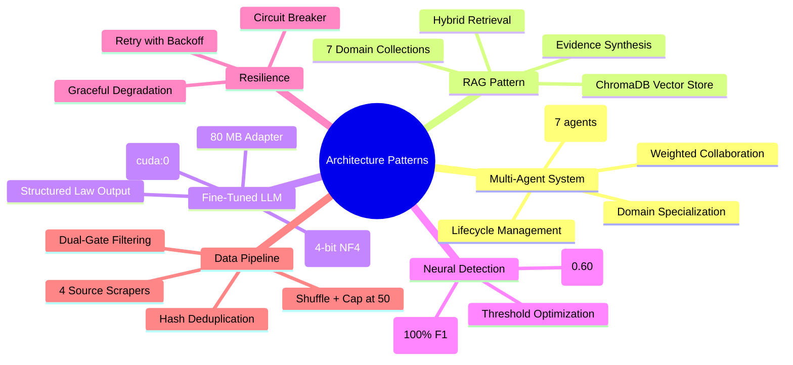

# System Architecture Diagrams

**Last Updated:** February 28, 2026
**System Status:** Production Ready — 7/7 Scorecard
**LLM:** Fine-tuned Mistral 7B QLoRA (cuda:0, 4-bit, ~4 GB VRAM)
**Signals Per Cycle:** 50 (from 93 raw across 4 sources)
**RAG Knowledge Base:** 59 chunks, 7 domains, 15 government laws
**Active Agents:** 7 (dynamically evolving)

---

## High-Level Architecture

```mermaid
graph TB
    subgraph "Real-Time Data Sources"
        A1[ArXiv API<br/>5 categories]
        A2[Reddit API<br/>9 subreddits]
        A3[RSS News<br/>6 feeds]
        A4[Legal RSS<br/>EFF + EU AI Act]
    end

    subgraph "Layer 1: Ingestion (50 signals/cycle)"
        B1[Signal Scrapers]
        B2[Deduplicator<br/>Hash-based]
        B3[API Validator]
        B4[Dual-Gate Filter<br/>AI + Ethics keywords]
    end

    subgraph "Layer 2: Knowledge & RAG"
        C1[ChromaDB Vector Store<br/>7 domains, 59 chunks]
        C2[Temporal Knowledge Graph<br/>Decay: S(t)=α^t·S(t-1)+E(t)]
        C3[Document Processor<br/>Chunking + Embedding]
        C4[Embedding Engine<br/>all-MiniLM-L6-v2, cuda:0]
    end

    subgraph "Layer 3: Cognitive Multi-Agent System"
        D1[Agent Pool<br/>7 active agents]
        D2[Neural Anomaly Detector<br/>threshold=0.60, cuda:0]
        D3[Attention Mechanism]
        D4[Agent Lifecycle Manager]
        D5[Collaboration Engine<br/>Weighted voting]
    end

    subgraph "Layer 4: Meta-Synthesis"
        E1[Document Retriever<br/>Hybrid search + re-rank]
        E2[Assessment Generator<br/>Evidence-based]
        E3[Evidence Synthesizer]
    end

    subgraph "Layer 5: Law Generation"
        F1[Meta Agent Generator]
        F2[Agent Registry]
        F3[Fine-tuned Mistral 7B<br/>QLoRA, 4-bit, cuda:0]
        F4[Law Quality Checker<br/>Structure validation]
    end

    subgraph "Output"
        G1[38 Legal Recommendations<br/>100% LLM-generated]
        G2[Ethical Assessments<br/>with citations]
        G3[System Evolution Log]
        G4[Performance Chart]
    end

    A1 & A2 & A3 & A4 --> B1
    B1 --> B2
    B2 --> B3
    B3 --> B4
    B4 --> C1 & C2
    C3 --> C1
    C4 --> C1

    C1 & C2 --> D1
    D1 --> D2
    D2 --> D3
    D3 --> D4
    D4 --> D5

    D1 --> E1
    E1 --> E2
    E2 --> E3

    D2 --> F1
    F1 --> F2
    F3 --> F1
    F3 --> F4
    F2 --> D1

    E3 --> G1 & G2
    F1 --> G3
    F4 --> G4

    style C1 fill:#90EE90
    style E1 fill:#87CEEB
    style E2 fill:#87CEEB
    style F3 fill:#FFB6C1
    style D2 fill:#DDA0DD
```

---

## RAG Workflow: Signal to Assessment

**Status:** Fully functional with fine-tuned Mistral 7B QLoRA
**Performance:** ~5 documents retrieved per assessment, 0.85 confidence scores



---

## Multi-Agent Collaboration Flow

**Active Agents (Production):**
- Fairness Monitor (bias) — Base agent
- Privacy Guardian (privacy) — Base agent
- General AI Ethics Overseer (general) — Evolved
- Security Compliance Monitor (security) — Evolved
- Accountability Monitor (accountability) — Evolved
- Transparency Monitor (transparency) — Evolved
- Safety Compliance Agent (safety) — Evolved



---

## Self-Evolution Process



---

## End-to-End Data Flow



---

## Component Layer Architecture



---

## GPU Memory Layout

```
NVIDIA RTX 4060 (8 GB VRAM)
┌──────────────────────────────────────────┐
│  Fine-tuned Mistral 7B QLoRA   ~4.0 GB  │
│  (4-bit NF4 + LoRA adapter)             │
├──────────────────────────────────────────┤
│  Embedding Model (MiniLM-L6)   ~0.1 GB  │
├──────────────────────────────────────────┤
│  Anomaly Detector NN           ~0.01 GB  │
├──────────────────────────────────────────┤
│  Domain Classifier NN          ~0.01 GB  │
├──────────────────────────────────────────┤
│  PyTorch CUDA Overhead         ~1.5 GB   │
├──────────────────────────────────────────┤
│  Free                          ~2.4 GB   │
└──────────────────────────────────────────┘
Total Used: ~5.6 GB / 8 GB
```

---

## Security & Privacy Architecture

**100% Local Operation:**
- No cloud API calls for LLM (fine-tuned model runs locally on GPU)
- No vector DB cloud services (ChromaDB stored at `./data/chromadb`)
- No external authentication required
- All data processing happens on local machine



---

## Project Structure

```
Perpetual Ethical Oversight MAS/
│
├── src/ingestion/                  — Signal Collection (50/cycle)
│   ├── ingestion_layer.py         ← Orchestrator (shuffle + cap at 50)
│   ├── academic_scrapers.py       ← ArXiv (5 categories: cs.CY/AI/LG/CL/CR)
│   ├── social_scrapers.py         ← Reddit (9 subreddits)
│   ├── news_scrapers.py           ← RSS (6 feeds)
│   ├── legal_scrapers.py          ← Legal RSS (EFF + EU AI Act)
│   ├── deduplicator.py            ← Hash-based deduplication
│   ├── api_validator.py           ← Response validation
│   └── async_io.py                ← Concurrent I/O
│
├── src/knowledge/                  — Knowledge Management
│   ├── graph.py                   ← Temporal knowledge graph
│   └── embeddings.py              ← SentenceTransformer (cuda:0)
│
├── src/rag/                        — RAG Pipeline (59 chunks, 7 domains)
│   ├── vector_store.py            ← ChromaDB interface
│   ├── retriever.py               ← Hybrid search + re-ranking
│   ├── generator.py               ← Assessment generation
│   └── document_processor.py      ← Policy ingestion + chunking
│
├── src/cognitive/                  — Multi-Agent Intelligence
│   ├── anomaly_detector.py        ← Neural detector (cuda:0, threshold=0.60)
│   ├── agent_lifecycle.py         ← Spawn/retire lifecycle
│   ├── agent_pool.py              ← Agent container
│   ├── collaboration.py           ← Weighted voting
│   └── attention.py               ← Attention mechanism
│
├── src/meta/                       — Law Generation & Meta-Learning
│   ├── llm_interface.py           ← Fine-tuned Mistral 7B loader (QLoRA, cuda:0)
│   ├── law_generator.py           ← RAG-enhanced law generation
│   ├── generator.py               ← Agent spec generation
│   ├── law_checker.py             ← Law quality validation
│   └── registry.py                ← Agent registry
│
├── src/training/                   — Neural Model Training
│   ├── trainer.py                 ← Training loop
│   ├── models.py                  ← Network architectures
│   ├── inference.py               ← Production inference (cuda:0)
│   ├── loss_functions.py          ← Custom losses
│   └── data_collector.py          ← Training data collection
│
├── models/                         — Model Artifacts
│   ├── mistral_law_generator/     ← QLoRA adapter (~80 MB)
│   └── trained/                   ← Neural weights (.pt)
│
├── data/                           — Data Storage
│   ├── chromadb/                  ← Vector DB (persistent)
│   └── training/                  ← Training datasets
│
├── scripts/                        — Operational Scripts
│   ├── run_system.py              ← Run system
│   ├── evaluate_system.py         ← Full evaluation (7/7)
│   ├── finetune_mistral_qlora.py  ← QLoRA fine-tuning
│   └── ...                        ← Training, ingestion, analysis
│
├── output/                         — Results
│   ├── legal_recommendations.json ← 38 LLM-generated laws
│   ├── system_state.json          ← Metrics + agent states
│   └── performance_comparison_chart.png
│
└── config/settings.py              — All configuration
```

---

## Key Design Patterns



---

**Note:** Diagrams are in Mermaid format and render in GitHub, GitLab, VS Code (with Mermaid extension), or at https://mermaid.live/
